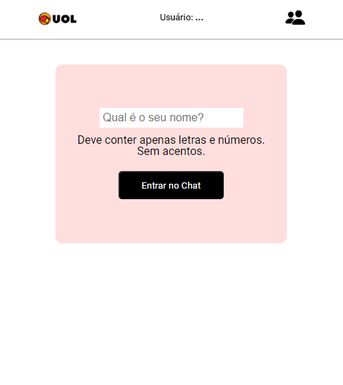
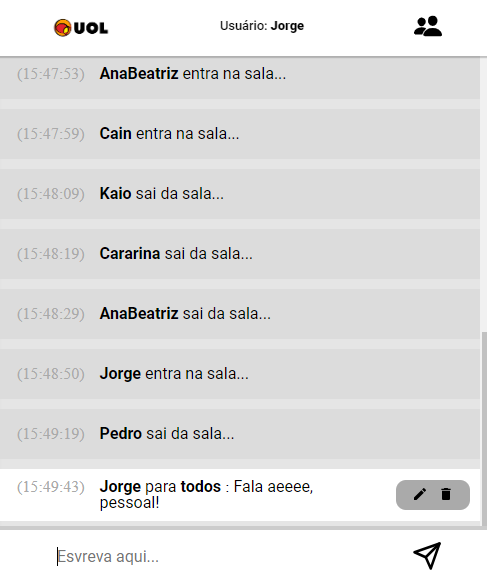
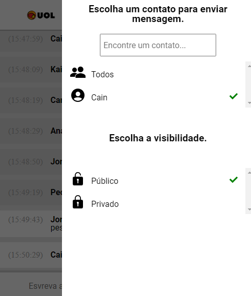
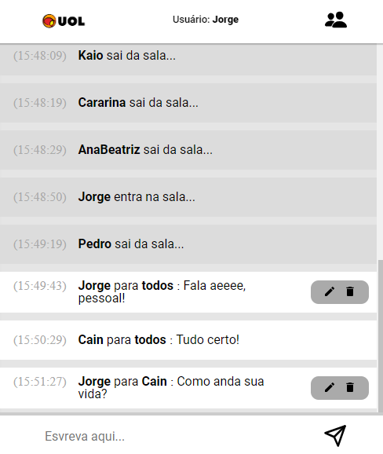
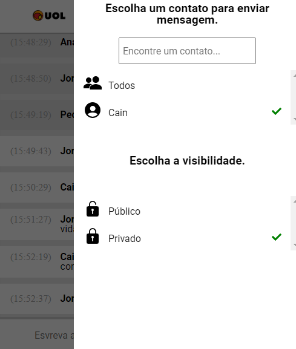
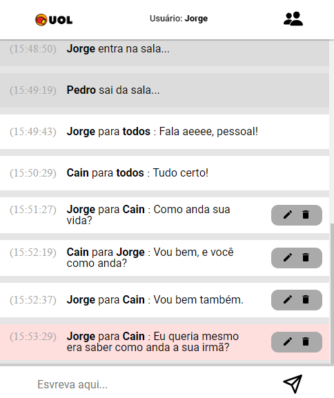
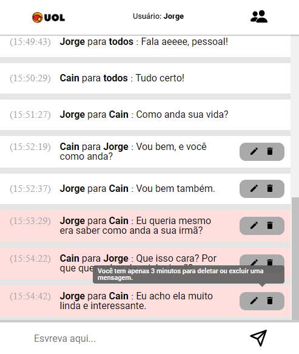
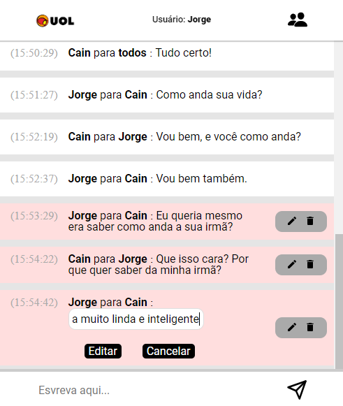
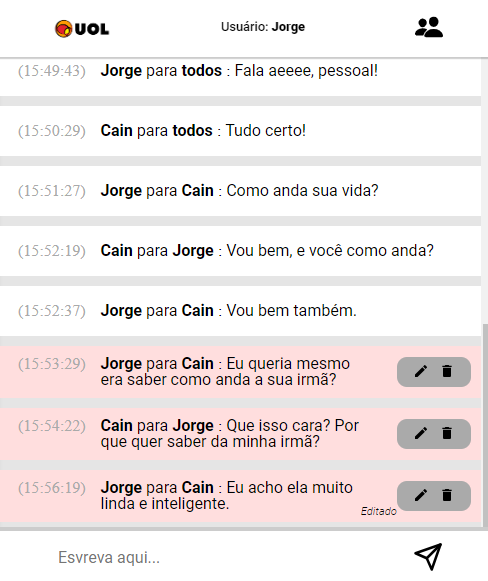
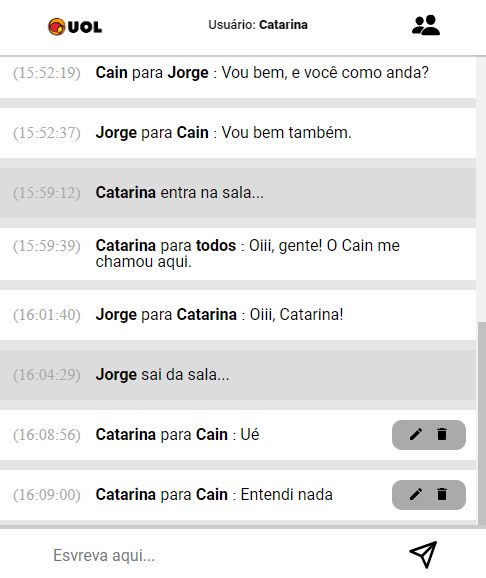

  

<h1 align="center">
  Pate Papo UOL
</h1>

  <h3>Built With:</h3>
  
  
  
  
    

  <!-- Badges source: https://dev.to/envoy_/150-badges-for-github-pnk -->

 

# Description

This front-end project simulates the classic chat platform "Pate Papo UOL," where users could engage in real-time conversations. With UOL API, you can chat with friends and meet new people. Experience a seamless and dynamic messaging environment designed for making connections and keeping conversations flowing.

 

## Features

-   Create an participant (do login);
-   When a participant enter in chat, a message of entrance start;
-   Send a message to everyone;
-   Send a message to a friend in public;
-   Send a message to a friend in private;
-   Edit a message

## Project Reference

### Enter in Chat

When enter in chat you have to put you name. This name must have just letters and text without other kind of signs.

### Sending a message to Everyone

As pattern if you write a message and send it, this message will happen to everybody that is logged in chat as a white message.

### Sending a message to a contact as public

You can change the message configuration in icon positioned at top right. If the room was empty, will appear the message "Você está sozinho na sala".

 

### Sending a message to a contact as private

You can choose a person on Contact List to send a private message

### Editing a message

You can edit a message. The time to do it is 3 minutes, after that is impossible edit a message.

### Delete a message

You can delete a message. The time to do it is 3 minutes, after that is impossible delete a message.

